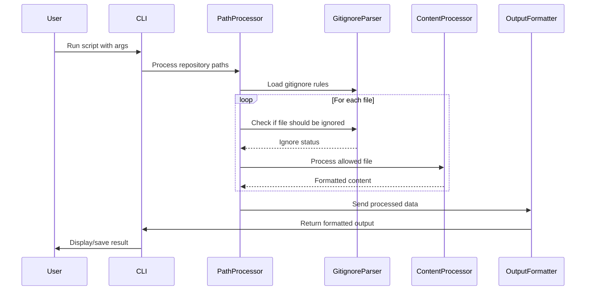
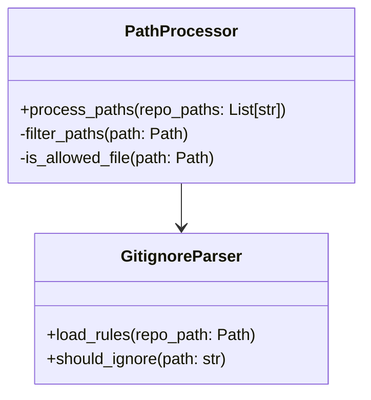

# Repository Prompt Generator Architecture

## Overview

The Repository Prompt Generator is designed with a modular architecture that emphasizes separation of concerns, maintainability, and extensibility. This document outlines the architectural decisions, components, and their interactions.

## Core Components

### 1. File System Interface
- **Path Management**: Utilizes Python's `pathlib` for cross-platform path handling
- **File Operations**: Handles file reading and directory traversal
- **Gitignore Integration**: Parses and applies `.gitignore` rules using `pathspec`

### 2. Content Processors
- **File Filter**: Manages file extension filtering and directory exclusions
- **Content Formatter**: Handles syntax highlighting and content structuring
- **Token Counter**: Optional token counting using `tiktoken`

### 3. Output Generators
- **File Map Generator**: Creates directory structure representation
- **Content Collector**: Aggregates and formats file contents
- **JSON Formatter**: Structures final output

## Data Flow

## Component Details

### Path Processor

### Content Processing Pipeline

The content processing follows a pipeline pattern:

1. **Input Stage**
   - Path validation
   - Extension checking
   - Directory filtering

2. **Processing Stage**
   - Content reading
   - Syntax detection
   - Format application

3. **Output Stage**
   - Structure generation
   - JSON formatting
   - Token counting (optional)

## Key Design Decisions

### 1. File Extension Management
- Maintained as a set for O(1) lookup performance
- Extensible through the `ALLOWED_EXTENSIONS` set
- Case-insensitive comparison for better usability

### 2. Directory Exclusion Strategy
- Two-tier approach:
  1. Default exclusions (`DEFAULT_SKIP_DIRS`)
  2. User-provided exclusions (via `--ignore-folders`)
- Efficient path component checking

### 3. Gitignore Integration
- Lazy loading of gitignore rules
- Caching of compiled patterns
- Support for nested .gitignore files

### 4. Error Handling
- Graceful degradation for missing features
- Clear error messages
- Fallback strategies for common issues

## Performance Considerations

1. **Memory Management**
   - Streaming file reading for large files
   - Path filtering before content loading
   - Efficient data structures for lookups

2. **Processing Efficiency**
   - Early filtering of unwanted files
   - Minimal string copies
   - Optimized path comparisons

3. **Scalability**
   - Support for multiple repositories
   - Parallel processing capability
   - Memory-efficient data structures

## Extension Points

The architecture supports several extension points:

1. **New File Types**
   - Add to `ALLOWED_EXTENSIONS`
   - Update `LANGUAGE_MAP` for syntax highlighting

2. **Output Formats**
   - Implement new output formatters
   - Add new CLI output options

3. **Content Processing**
   - Add new content processors
   - Implement custom filtering rules

## Future Considerations

1. **Potential Improvements**
   - Parallel processing for large repositories
   - Incremental updates
   - Caching mechanism for frequently accessed repos

2. **Planned Features**
   - Custom file type handlers
   - Plugin system for extensions
   - Remote repository support

## Configuration Management

The tool uses a hierarchical configuration approach:

1. **Built-in Defaults**
   - File extensions
   - Skip directories
   - Language mappings

2. **Environment Configuration**
   - Token counting availability
   - Clipboard support

3. **Runtime Configuration**
   - Command-line arguments
   - User-provided exclusions
   - Custom instructions

## Testing Strategy

1. **Unit Tests**
   - Component isolation
   - Mock file system operations
   - Pattern matching verification

2. **Integration Tests**
   - End-to-end workflows
   - Multiple repository scenarios
   - Edge case handling

3. **Performance Tests**
   - Large repository handling
   - Memory usage monitoring
   - Processing time benchmarks 